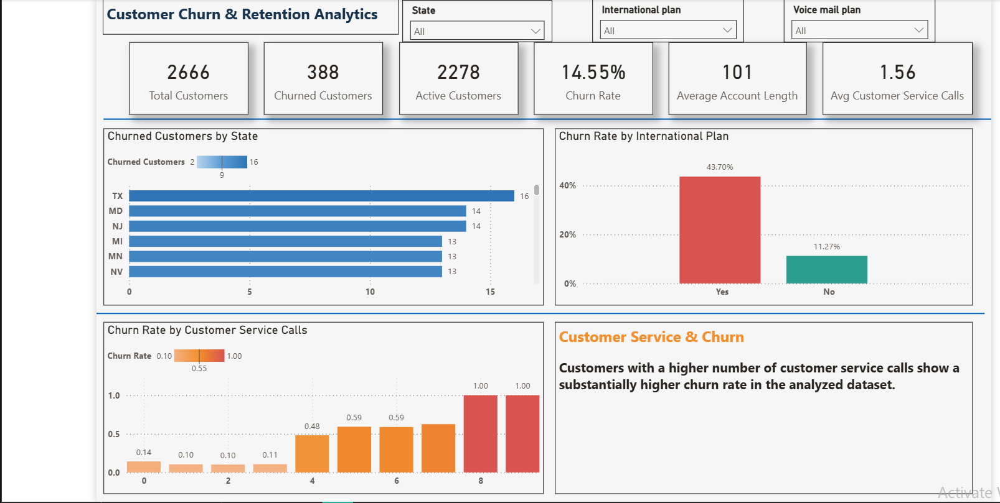
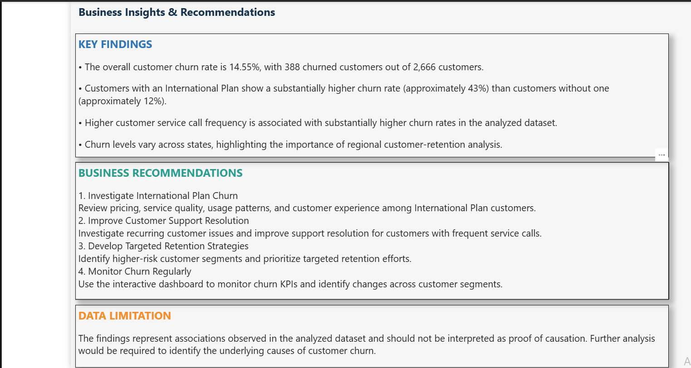
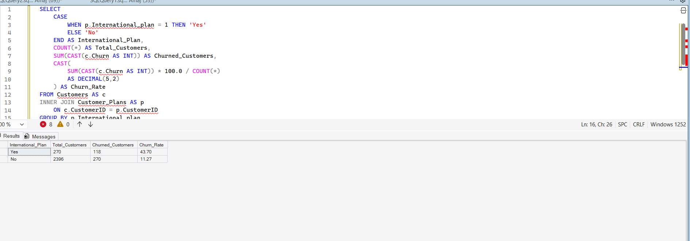
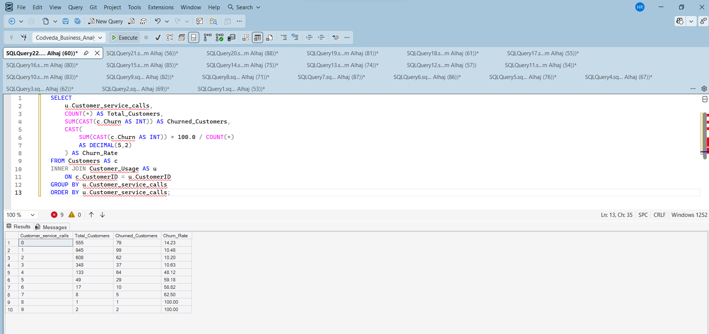
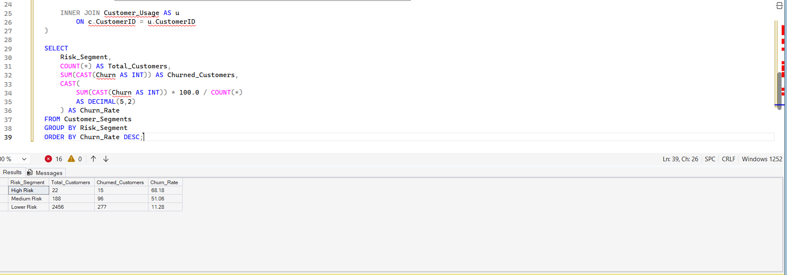
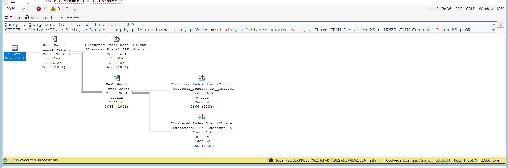

# Codveda Business Analytics Internship


## Overview

This repository contains my completed work for the **Codveda Technologies Business Analytics Internship**.

The project focuses on customer churn and retention analysis using **Microsoft Power BI** and **SQL Server**. The analysis combines interactive business intelligence dashboards with SQL-based data analysis, customer segmentation, joins, indexing, and execution-plan review.


## Project Visuals

### Task 1 – Power BI Customer Churn & Retention Analytics

#### Executive Dashboard

<p align="center">
  
</p>

#### Business Insights

<p align="center">
  
</p>

---

### Task 2 – SQL Server Business Analytics

#### International Plan Churn Analysis

<p align="center">
  
</p>

#### Customer Service Calls Analysis

<p align="center">
  
</p>

#### Customer Risk Segmentation

<p align="center">
  
</p>

#### SQL Indexing

<p align="center">
  
</p>

#### SQL Server Execution Plan

<p align="center">
  
</p>


## Project Structure

```text
Codveda_Business_Analytics_Hashem/
│
├── Task_1_PowerBI/
│   ├── Customer Churn & Retention Analytics.pbix
│   ├── Executive_Dashboard.png
│   ├── Business_Insights.png
│   └── README.md
│
└── Task_2_SQL/
    ├── Codveda_Business_Analytics_SQL.sql
    ├── SQL_International_Plan.png
    ├── SQL_Service_Calls.png
    ├── SQL_Risk_Segmentation.png
    ├── SQL_Indexes.png
    ├── SQL_Execution_Plan.png
    └── README.md
```

## Task 1 – Power BI

### Customer Churn & Retention Analytics

An interactive Power BI dashboard designed to analyze customer churn and retention patterns.

### Key KPIs

| KPI | Result |
|---|---:|
| Total Customers | 2,666 |
| Churned Customers | 388 |
| Active Customers | 2,278 |
| Overall Churn Rate | 14.55% |
| Average Account Length | 101 |
| Average Customer Service Calls | 1.56 |

### Main Insights

- Overall customer churn rate is **14.55%**.
- Customers with an **International Plan** have a substantially higher churn rate (**43.70%**) compared with customers without an International Plan (**11.27%**).
- Higher customer service call frequency is associated with substantially higher churn rates in the analyzed dataset.
- Churn levels vary across states, supporting the need for regional customer-retention analysis.

### Business Recommendations

- Investigate the reasons behind higher churn among International Plan customers.
- Improve customer support resolution for customers with frequent service calls.
- Develop targeted retention strategies for higher-risk customer segments.
- Monitor churn KPIs regularly through the interactive dashboard.

## Task 2 – SQL Business Analytics

The SQL task uses multiple related tables and demonstrates practical SQL Server analytics.

### Tables Used

- `Customers`
- `Customer_Plans`
- `Customer_Usage`
- `Customer_Segments`

### SQL Techniques Demonstrated

- Multi-table `INNER JOIN`
- Aggregation using `COUNT()` and `SUM()`
- `GROUP BY` and `ORDER BY`
- Churn-rate calculations
- Customer risk segmentation
- Index creation and verification
- SQL Server execution-plan analysis
- Logical-read and execution-statistics review

### Main SQL Findings

| Analysis | Key Result |
|---|---|
| International Plan | 43.70% churn |
| No International Plan | 11.27% churn |
| High Risk Segment | 68.18% churn |
| Medium Risk Segment | 51.06% churn |
| Lower Risk Segment | 11.28% churn |

The customer service-call analysis also shows substantially higher churn rates at higher call frequencies in the analyzed dataset.

## Tools & Technologies

- **Microsoft Power BI**
- **SQL Server / SSMS**
- **SQL**
- **Power BI data modeling and visualization**
- **Execution Plan Analysis**
- **SQL Indexing**

## Business Value

The project demonstrates how data can be transformed into actionable business insights by combining:

**Data → SQL Analysis → Power BI Visualization → Business Insights → Retention Recommendations**

The results can help identify higher-risk customer groups and areas that require further investigation to improve customer retention.

## Data Limitation

The findings represent associations observed in the analyzed dataset and should not be interpreted as proof of causation. Further analysis would be required to identify the underlying causes of customer churn.

## Internship Deliverables

This repository contains the completed deliverables for:

- **Task 1 – Power BI Customer Churn & Retention Analytics**
- **Task 2 – SQL Business Analytics**

Each task includes its own README with additional details and supporting files.

---

**Intern:** Hashem Alrabee  
**Program:** Codveda Technologies – Business Analytics Internship
